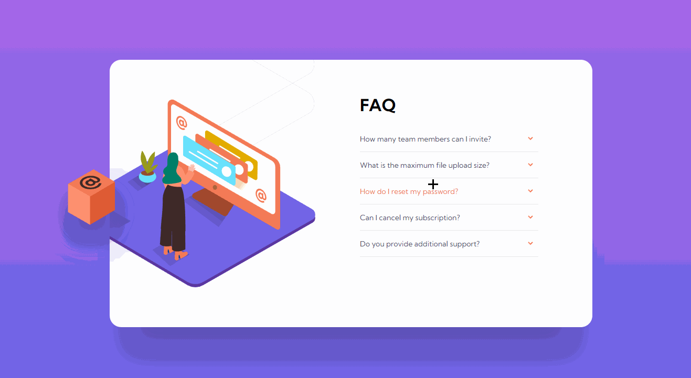
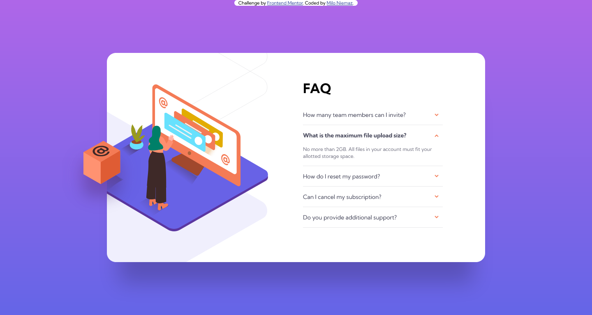

# Frontend Mentor - FAQ accordion card solution

This is a solution to the [FAQ accordion card challenge on Frontend Mentor](https://www.frontendmentor.io/challenges/faq-accordion-card-XlyjD0Oam). Frontend Mentor challenges help you improve your coding skills by building realistic projects. 

## Table of contents

- [Overview](#overview)
  - [The challenge](#the-challenge)
  - [Screenshot](#screenshot)
  - [Links](#links)
- [My process](#my-process)
  - [Built with](#built-with)
  - [What I learned](#what-i-learned)
  - [Useful resources](#useful-resources)
- [Author](#author)

## Overview

### The challenge

Users should be able to:

- View the optimal layout for the component depending on their device's screen size
- See hover states for all interactive elements on the page
- Hide/Show the answer to a question when the question is clicked

### Screenshot





### Links

- Solution URL: [My solution](https://polec4t.github.io/challenge-5-faq_accordion_card_main/)

## My process

### Built with

- Semantic HTML5 markup
- CSS custom properties
- JS 
- Flexbox
- position relative/absolute
- CSS perspective properties

### What I learned

I am proud of the animation of the list when you click on an element, I used a flex display property "flex-grow" associated with other flex display properties.

```css
/* container of question/answer */
ul > li {
  flex-shrink: 1;
  flex-grow: 1;
  overflow: hidden;
  transition: flex-grow 0.4s ease-out;
  position: relative;
}

/* active container of question/answer */
.active {
  flex-grow: 1000;
}
```
Of course the class active is toggled whenever an element of the list is clicked.

I am also proud of the way I managed to make the cube move and I really like the final result.

```js
const cube = document.querySelector("#div-cube");

document.addEventListener("mousemove", (event) => {
  let quotient;
  // are we on a mobile screen ?
  mobile ? quotient = 100 : quotient = 50;
  // move the cube according to the cursor position
  cube.style.transform = `translate(-${event.pageX / quotient}px, -${event.pageY / quotient}px)`;
});
```


I had a first approach of the perspective in css, I created the animation of my arrows with it. I really liked using perspective, I think I will do it again, there is a lot of things to exploit in this area.

```css
.arrow-wrapper {
  perspective: 2000px;
  perspective-origin: top;
}

.arrow {
  transform-style: preserve-3d;
  transition: transform 0.5s cubic-bezier(0, 0, 0.07, 1);
}

.active .arrow {
  transform: rotateX(180deg);
}
```

### Useful resources

- [Perspective youtube video](https://www.youtube.com/watch?v=ursf79ZAI8c&t=577s) - This helped me to understand perspective.
- [List animation youtube video](https://www.youtube.com/watch?v=gowLBZivZDY) - This helped me to make the animation of the list. I really like the final result and will reuse it in the future.

## Author

- Frontend Mentor - [@POLEC4T](https://www.frontendmentor.io/profile/yourusername)


